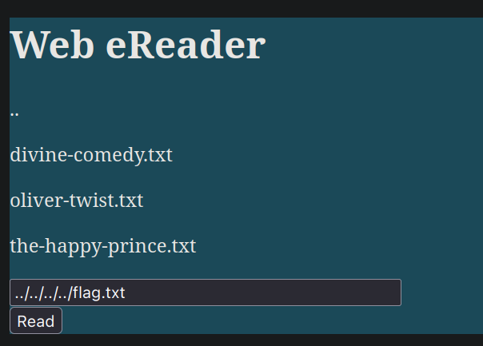
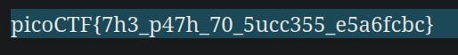
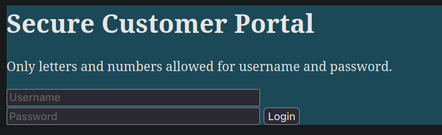

# cass

# Forbidden Paths

**Flag:** `picoCTF{7h3_p47h_70_5ucc355_e5a6fcbc}`

Here, the flag is given in the file `/flag.txt`, but absolute paths are not allowed to be entered. We know an nginx website is stored at `/usr/share/nginx/html/`, so we use relative file paths to traverse to the file.



Since we are four levels deep in the root directory, we use `../` four times.



So the flag turns out to be `picoCTF{7h3_p47h_70_5ucc355_e5a6fcbc}`.

# Local Authority

**Flag:** `picoCTF{j5_15_7r4n5p4r3n7_05df90c8}`

We are given a website `http://saturn.picoctf.net:50920/`, which opens to a login page.



We open our browser's network tab and enter meaningless data in the input fields. After that we open the request titled `secure.js` and go into its *Response* tab.


We find the following (very insecure!) JavaScript code that checks whether the username and password are that of the admin's or not

```
function checkPassword(username, password)
{
  if( username === 'admin' && password === 'strongPassword098765' )
  {
    return true;
  }
  else
  {
    return false;
  }
}
```

Therefore, the username we need is `admin` and the password `strongPassword098765`. Using these details, we successfully log in and acquire the flag.


