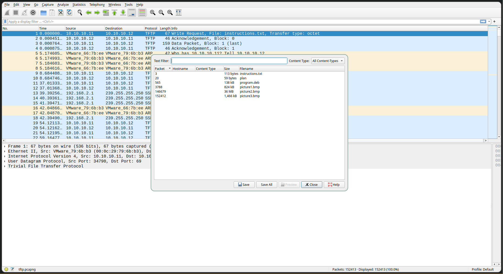
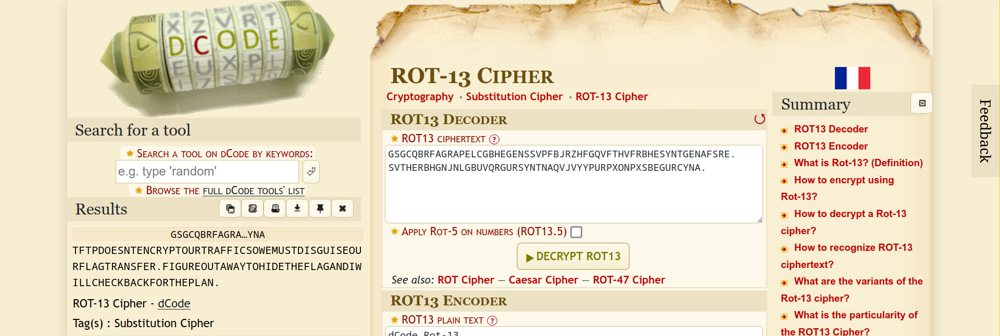

# tunn3l v1s10n

# Trivial Flag Transfer Protocol

**Flag:** `picoCTF{h1dd3n_1n_pLa1n_51GHT_18375919}`

We get a file `tftp.pcapng`. Opening it in `wireshark`, we extract all the files transferred using the `TFTP` protocol.



In the file `instructions.txt`, the message is `GSGCQBRFAGRAPELCGBHEGENSSVPFBJRZHFGQVFTHVFRBHESYNTGENAFSRE.SVTHERBHGNJNLGBUVQRGURSYNTNAQVJVYYPURPXONPXSBEGURCYNA.`, and seems to be a `ROT-13` cipher. And indeed, decoding it we get



Removing the spaces, the instructions seem to be

*"TFTP doesn't encrypt our traffic so we must disguise our flag transfer. Figure out a way to hide the flag and I will check back for the plan."*

In the file `plan`, we follow the same process


Using the same method we did earlier with `ROT-13`, we get the final message as

*"I used the program and hid it with - due diligence. Check out the photos."*

We also have three images and a `.deb` file

```
~/Downloads $ ls -1
instructions.txt
picture1.bmp
picture2.bmp
picture3.bmp
plan
program.deb
tftp.pcapng
```

Extracting the `.deb` package, we're greeted to three new files

```
~/Downloads/program $ ar x program.deb
~/Downloads/program $ ls -1
control.tar.gz
data.tar.xz
debian-binary
program.deb
```

Extracting `data.tar.xz`, we discover that the program being used was `steghide`

```
~/Downloads/program $ atool -x data.tar.xz
.
.
.
./usr/share/locale/fr/
./usr/share/locale/fr/LC_MESSAGES/
./usr/share/locale/fr/LC_MESSAGES/steghide.mo
./usr/share/locale/de/
./usr/share/locale/de/LC_MESSAGES/
./usr/share/locale/de/LC_MESSAGES/steghide.mo
./usr/share/locale/es/
./usr/share/locale/es/LC_MESSAGES/
./usr/share/locale/es/LC_MESSAGES/steghide.mo
./usr/bin/
./usr/bin/steghide
data.tar.xz: extracted to `usr'
```

`steghide` requires a passphrase to extract data from images. Remember the sentence

> IUSEDTHEPROGRAMANDHIDITWITH-DUEDILIGENCE.CHECKOUTTHEPHOTOS.

This seems to hint at the passphrase being `DUEDILIGENCE`. Trying it on the three images, we get the following results

```
~/Downloads $ steghide --extract -sf picture1.bmp
Enter passphrase:
steghide: could not extract any data with that passphrase!
~/Downloads $ steghide --extract -sf picture2.bmp
Enter passphrase:
steghide: could not extract any data with that passphrase!
~/Downloads $ steghide --extract -sf picture3.bmp
Enter passphrase:
wrote extracted data to "flag.txt".
```

And now using `cat` on the flag file, we get


```
~/Downloads $ cat flag.txt
picoCTF{h1dd3n_1n_pLa1n_51GHT_18375919}
```

# MacroHard WeakEdge

**Flag:** `picoCTF{D1d_u_kn0w_ppts_r_z1p5}`

We're given a file `Forensics is fun.pptm`. Since PPT files are essentially zip files, we change its extension to `.zip` and extract it.

```
~/Downloads $ mv Forensics\ is\ fun.pptm Forensics\ is\ fun.zip
renamed 'Forensics is fun.pptm' -> 'Forensics is fun.zip'
~/Downloads $ atool -x Forensics\ is\ fun.zip
Archive:  Forensics is fun.zip
  inflating: Unpack-3555/[Content_Types].xml
  inflating: Unpack-3555/_rels/.rels
  inflating: Unpack-3555/ppt/presentation.xml
  inflating: Unpack-3555/ppt/slides/_rels/slide46.xml.rels
  inflating: Unpack-3555/ppt/slides/slide1.xml
  inflating: Unpack-3555/ppt/slides/slide2.xml
  inflating: Unpack-3555/ppt/slides/slide3.xml
.
.
.
```

Entering the directory `Forensics is fun`, we find a file called `hidden` inside the `ppt/slideMasters` subdirectory. The contents of it are

```
…/Downloads/Forensics is fun/ppt/slideMasters $ cat hidden
Z m x h Z z o g c G l j b 0 N U R n t E M W R f d V 9 r b j B 3 X 3 B w d H N f c l 9 6 M X A 1 f Q
```

It seems to be a base64 cipher. Removing the spaces and using `base64` on it, we get the following output

```
…/Downloads/Forensics is fun/ppt/slideMasters $ sed -i 's/ //g' hidden
…/Downloads/Forensics is fun/ppt/slideMasters $ cat hidden
ZmxhZzogcGljb0NURntEMWRfdV9rbjB3X3BwdHNfcl96MXA1fQ
…/Downloads/Forensics is fun/ppt/slideMasters $ base64 -d hidden
flag: picoCTF{D1d_u_kn0w_ppts_r_z1p5}
```
