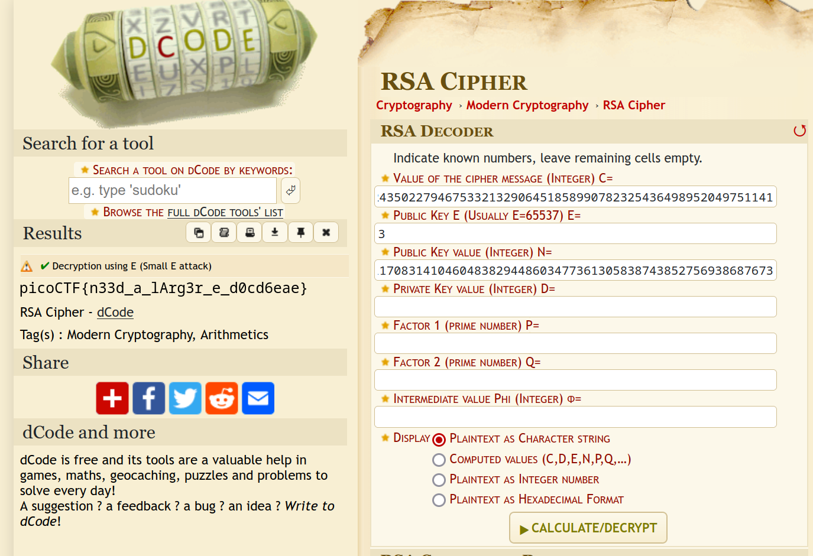

# New Caesar

# miniRSA

**Flag:** `picoCTF{n33d_a_lArg3r_e_d0cd6eae}`

Here, we get a file `ciphertext` with the following contents

```
N: 29331922499794985782735976045591164936683059380558950386560160105740343201513369939006307531165922708949619162698623675349030430859547825708994708321803705309459438099340427770580064400911431856656901982789948285309956111848686906152664473350940486507451771223435835260168971210087470894448460745593956840586530527915802541450092946574694809584880896601317519794442862977471129319781313161842056501715040555964011899589002863730868679527184420789010551475067862907739054966183120621407246398518098981106431219207697870293412176440482900183550467375190239898455201170831410460483829448603477361305838743852756938687673
e: 3

ciphertext (c): 2205316413931134031074603746928247799030155221252519872650080519263755075355825243327515211479747536697517688468095325517209911688684309894900992899707504087647575997847717180766377832435022794675332132906451858990782325436498952049751141
```

It looks like a simple RSA encrypted cipher text. Notice the small value of `e` (3). It ideally should be something much larger like `65537` or the cipher can be easily brute-forced. We do exactly that, using the [dcode RSA decryptor](https://www.dcode.fr/rsa-cipher)



# basic-mod1

**Flag:** `picoCTF{R0UND_N_R0UND_ADD17EC2}`

In this challenge, a message is to be decrypted in the following fashion:

1. Each number is converted to its remainder after division by 37, i.e. *mod 37*
2. The subsequent remainders are then used as indices in the following manner:
    - Digits 0 to 25 are mapped as the uppercase alphabet.
    - Digits 26 to 35 are mapped as the ten digits.
    - 36 is an underscored `_`.

The python code for the decoding using this algorithm is this

```
import string

x = [350, 63, 353, 198, 114, 369, 346, 184, 202, 322, 94, 235, 114, 110, 185, 188, 225, 212, 366, 374, 261, 213] # Contents of `message.txt` converted to an array

keys = []

for i in string.ascii_uppercase + string.digits + '_':
    keys.append(i)

for i in x:
    print(keys[i % 37])

```

Executing it, we get the following output

```
~/Downloads $ python3 main.py
R
0
U
N
D
_
N
_
R
0
U
N
D
_
A
D
D
1
7
E
C
2
~/Downloads $ python3 main.py | tr -d '\n'
R0UND_N_R0UND_ADD17EC2
~/Downloads $
```

So the flag becomes `picoCTF{R0UND_N_R0UND_ADD17EC2}`.
