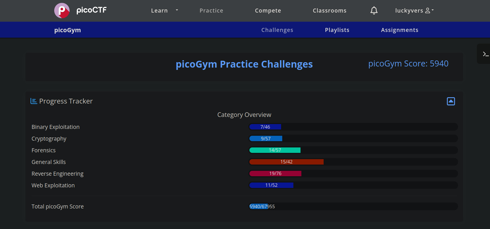

# PicoCTF

Challenges for the second part of **Cryptonite's** Junior Taskphase (JTP).

The final dashboard looks as follows

| Domain              | Count | Pending |
| ------------------- | :---: |  :---:  |
| Web Exploitation    |   3   |    0    |
| Reverse Engineering |   3   |    0    |
| Forensics           |   3   |    0    |
| Binary Exploitation |   3   |    0    |
| Cryptography        |   3   |    0    |
| Total               |   15  |    0    |

